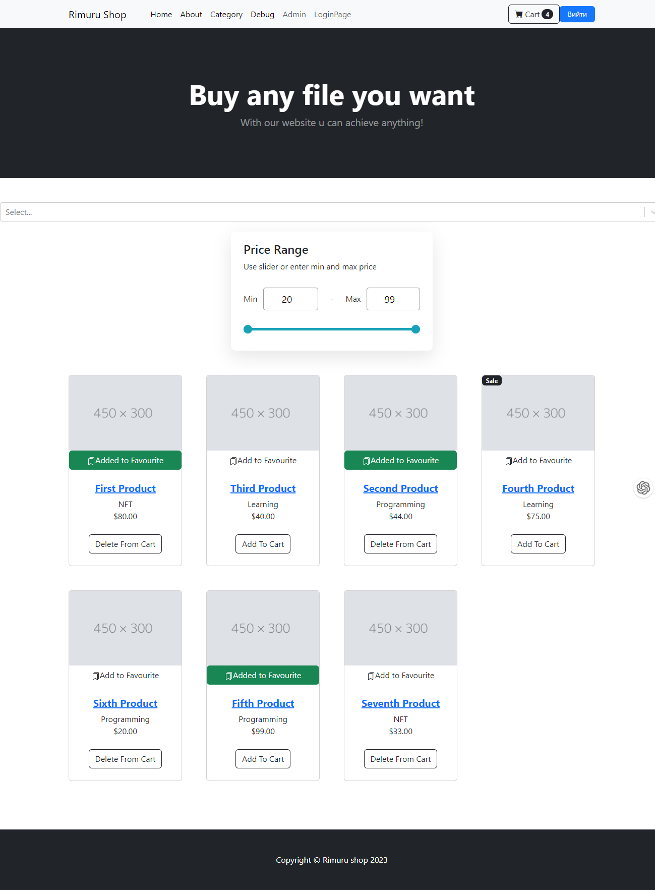

# React-Shop
[](https://github.com/RaxFord1/react-shop/blob/master/LICENSE.md)

## Table of Contents
- [About](#about)
- [Features](#features)
- [Tech Stack](#tech-stack)
- [File Structure](#file-structure)
- [Backend Information](#backend-information)
- [How to Use](#how-to-use)

## About
Welcome to React-Shop! This is a robust e-commerce web application designed with React.js. Packed with an extensive range of features including displaying items and categories, cart functionality, user reviews, and an admin panel. The application provides a comprehensive framework for individuals or teams aspiring to build an e-commerce platform.

Explore a variety of items, register to create an account, log in, add items to your cart, filter items by categories and price, select your favorites, and checkout when you're ready. Every item comes with a detailed description to enhance your shopping experience. For the administrators, React-Shop offers a panel to manage items and categories by adding, editing, or deleting as necessary.

## Screenshot



Here's a snapshot of what React-Shop looks like. Feel free to navigate through the application to explore more features.

## Features
React-Shop offers a variety of features, including:
- Item display with detailed views
- Cart functionality
- User reviews and ratings
- Admin panel for item and category management
- User registration and login
- Price range filter
- Currency converter

## Tech Stack
React-Shop is built with a focus on the following technology:
- React.js
- CSS Modules
- JavaScript
- HTML

## File Structure
Here's a quick look at the file structure of React-Shop:
- `src/components`: Contains various reusable components such as Card, Badge, Header, etc.
- `src/pages`: Includes the main pages of the application like IndexPage, CartPage, LoginPage, and AdminPage.
- `src/store`: Maintains state of the project using react-context.
- `src/images`: Stores static images for the application.

## Backend Information
React-Shop uses a separate backend built with Python, Flask, SQLAlchemy, and PostgreSQL. This backend handles data operations, user authentication, and other server-side tasks. You can check out the backend repository [here](https://github.com/RaxFord1/react-shop-backend).

## How to Use
To get started with React-Shop, clone the repository, navigate to the project directory, and install dependencies:
```sh
git clone https://github.com/RaxFord1/react-shop.git
cd react-shop
npm install
```

### To start the development server:

```sh
npm start
```
### To build the application for production:

```sh
npm run build
```

Thank you for considering React-Shop for your e-commerce solution!
